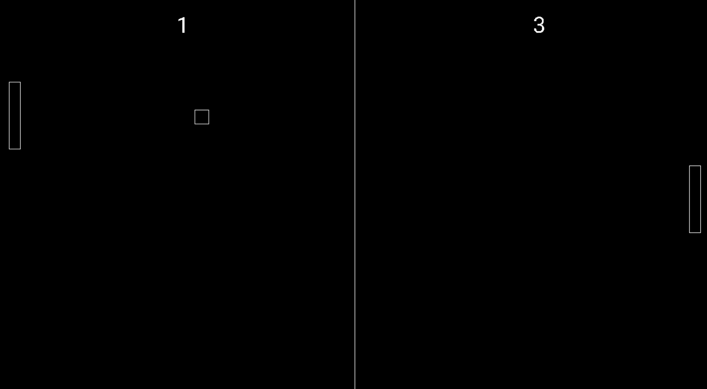

# CPP Pong



This is a practice project using SDL2 to implement Pong, and practice using CMake as a build system.  It was my first C++ project, and it is horrendously overengineered.  I wanted to get comfortable with pointers so I used them for *everything*.  I also knew nothing about how to architect a game engine, and by the time I figured out what I *should* have done, I had already cooked up some fresh Italian pasta.

## Dependencies

(If Building with CMake)
- SDL2, SDL2_ttf required
- Working SDL2 and SDL2_ttf versions included in the Deps directory.
- Move SDL2.dll and SDL2_ttf.dll to the out/build/src directory.

## How To Build

### Build
- Clone this repo:
    ```git  clone https://github.com/devin-hale/Pong```

- Ensure that all dependencies are available to the CMake PATH.

- Navigate to the folder

- Configure project using CMake
    ```cmake -B /out/build ./```

- Build project using CMake
    ```cmake -B /out/build -S```

- Run Pong.exe
